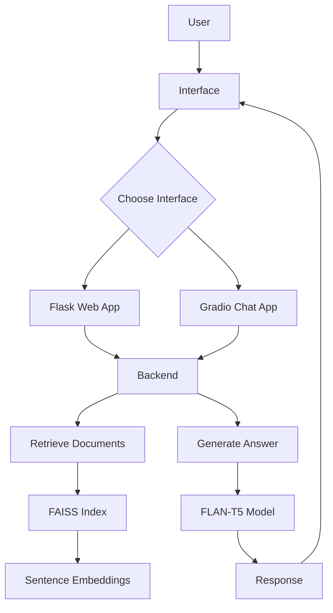

# Insurance Chatbot RAG

A Retrieval-Augmented Generation (RAG) chatbot designed to answer insurance-related queries using a knowledge base of insurance documents. This project implements two user interfaces: a web-based Flask application and a Gradio-based chat interface.

## Features

- **Retrieval-Augmented Generation (RAG)**: Combines document retrieval with generative AI for accurate, context-aware responses.
- **Vector Search**: Uses FAISS for efficient similarity search on embedded documents.
- **Multiple Interfaces**: 
  - Web UI via Flask with custom HTML/CSS/JavaScript.
  - Interactive chat via Gradio.
- **Pre-trained Models**: 
  - Sentence Transformers for document embeddings.
  - FLAN-T5 for text generation.
- **Knowledge Base**: JSON-based document storage for easy updates and maintenance.

## System Architecture

The system follows a RAG pipeline:



- **User**: Interacts via web interface or Gradio app.
- **Interface**: Handles user input and displays responses.
- **Backend**: Processes queries, retrieves relevant documents, and generates answers.
- **Retrieval**: Uses FAISS to find top-k similar documents based on question embeddings.
- **Generation**: FLAN-T5 generates answers using retrieved context.

## Installation

### Prerequisites

- Python 3.8 or higher
- Virtual environment (recommended)

### Steps

1. **Clone the repository**:
   ```bash
   git clone https://github.com/your-username/insurance-chatbot-rag.git
   cd insurance-chatbot-rag
   ```

2. **Create a virtual environment**:
   ```bash
   python -m venv venv
   source venv/bin/activate  # On Windows: venv\Scripts\activate
   ```

3. **Install dependencies**:
   ```bash
   pip install -r requirements.txt
   ```

4. **Download models** (automatic on first run):
   - Sentence Transformers: `all-MiniLM-L6-v2`
   - FLAN-T5: `google/flan-t5-small`

## Usage

### Flask Web Application

Run the Flask app for a custom web interface:

```bash
python app.py
```

- Open your browser to `http://localhost:5000`
- Type your insurance-related questions in the chat interface.

### Gradio Chat Interface

Run the Gradio app for an interactive chat:

```bash
python rag_gradio.py
```

- A Gradio interface will launch in your browser.
- Chat with the AI assistant about insurance topics.

### Backend Only

You can also use the backend directly:

```python
from backend import generate_answer

answer, sources = generate_answer("What is motor insurance?")
print(answer)
```

## Dependencies

- `langchain`: For RAG chain implementation.
- `langchain-community`: Community extensions for LangChain.
- `faiss-cpu`: Vector search library.
- `transformers`: Hugging Face transformers for models.
- `datasets`: For data handling.
- `sentence-transformers`: For embedding models.
- `gradio`: For the chat interface.
- `flask`: For the web application.

See `requirements.txt` for exact versions.

## Data

- `documents.json`: Contains insurance-related documents with titles and content.
- Pre-built FAISS index in `faiss_index/`.
- Model files in `models/` directory.

## Contributing

1. Fork the repository.
2. Create a feature branch: `git checkout -b feature-name`
3. Commit changes: `git commit -am 'Add feature'`
4. Push to branch: `git push origin feature-name`
5. Submit a pull request.

## License

This project is licensed under the MIT License - see the LICENSE file for details.

## Acknowledgments

- Built with Hugging Face Transformers and Sentence Transformers.
- FAISS for efficient vector search.
- Gradio and Flask for user interfaces.